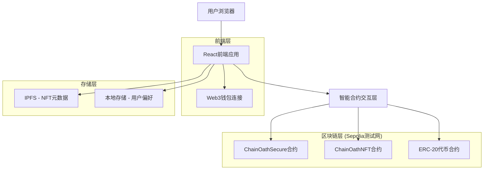
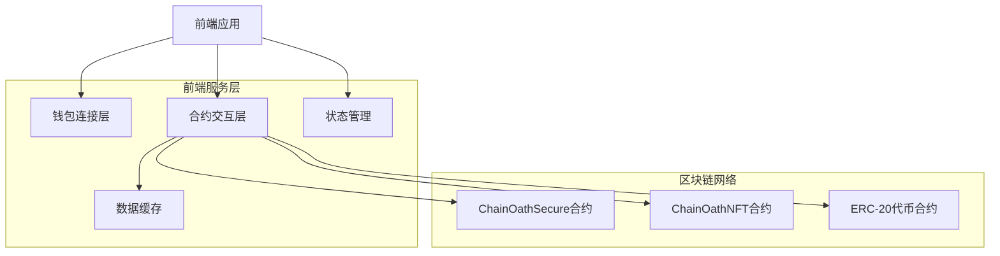
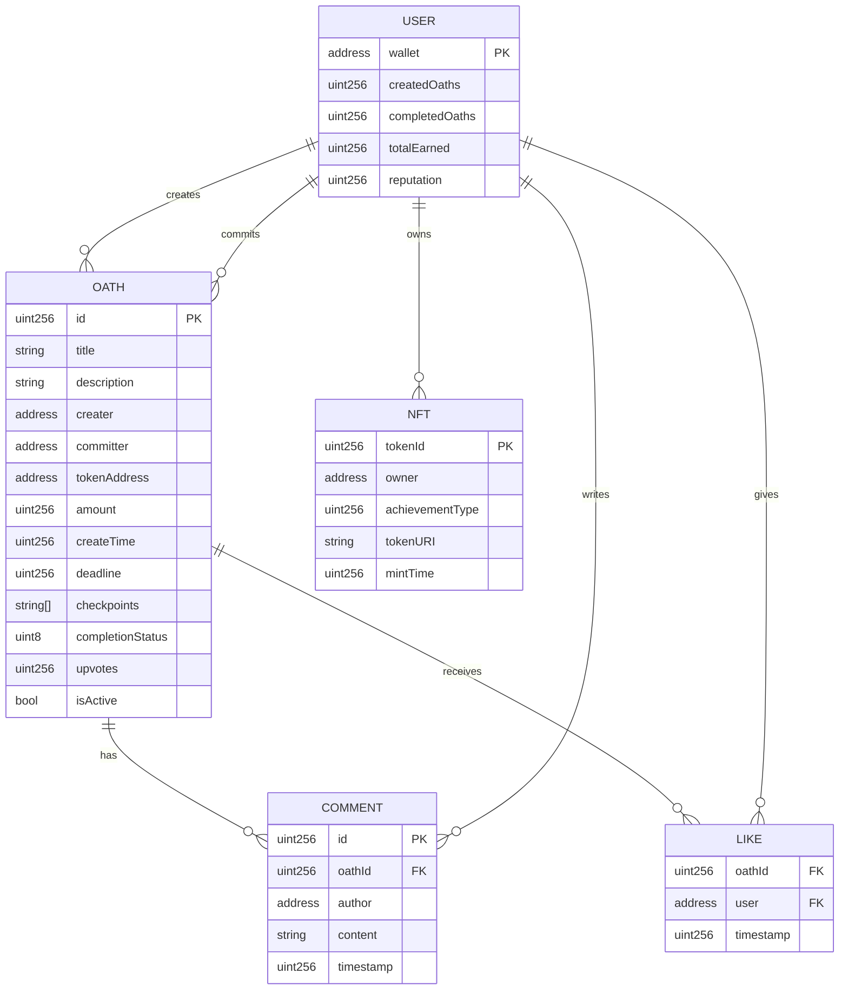

# ChainOath技术架构文档

## 1. 架构设计



## 2. 技术描述

- **前端**: React@18 + TypeScript + TailwindCSS + Vite
- **区块链交互**: ethers.js@6 + wagmi + viem
- **钱包连接**: RainbowKit + WalletConnect
- **状态管理**: Zustand
- **UI组件**: Headless UI + Heroicons
- **构建工具**: Vite + ESLint + Prettier
- **智能合约**: Solidity@0.8.19 + Foundry
- **测试框架**: Foundry Test + React Testing Library
- **部署网络**: Sepolia测试网

## 3. 路由定义

| 路由 | 用途 |
|------|------|
| / | 首页，显示誓约列表和平台统计 |
| /create | 创建誓约页面，表单填写和资金质押 |
| /oath/:id | 誓约详情页面，显示具体誓约信息和操作 |
| /my-oaths | 我的誓约页面，个人誓约管理 |
| /achievements | 成就中心页面，NFT展示和铸造 |
| /admin | 管理面板页面，合约管理和数据统计 |

## 4. API定义

### 4.1 智能合约接口

**ChainOathSecure合约核心方法**

创建誓约
```solidity
function createOath(
    string memory title,
    string memory description,
    address committer,
    address tokenAddress,
    uint256 amount,
    uint256 deadline,
    string[] memory checkpoints
) external returns (uint256 oathId)
```

参数说明:
| 参数名 | 参数类型 | 是否必需 | 描述 |
|--------|----------|----------|------|
| title | string | true | 誓约标题 |
| description | string | true | 誓约描述 |
| committer | address | true | 守约人地址 |
| tokenAddress | address | true | ERC-20代币合约地址 |
| amount | uint256 | true | 奖励金额 |
| deadline | uint256 | true | 截止时间戳 |
| checkpoints | string[] | true | 检查点数组 |

评估完成状态
```solidity
function evaluateCompletion(
    uint256 oathId,
    bool isCompleted,
    string memory feedback
) external
```

点赞誓约
```solidity
function likeOath(uint256 oathId) external
```

添加评论
```solidity
function addComment(
    uint256 oathId,
    string memory content
) external
```

**ChainOathNFT合约核心方法**

铸造成就NFT
```solidity
function mintAchievement(
    address to,
    uint256 achievementType,
    string memory tokenURI
) external returns (uint256 tokenId)
```

检查铸造权限
```solidity
function canMintAchievement(
    address user,
    uint256 achievementType
) external view returns (bool)
```

### 4.2 前端服务接口

**钱包连接服务**
```typescript
interface WalletService {
  connect(): Promise<string>;
  disconnect(): Promise<void>;
  getAddress(): Promise<string>;
  getBalance(tokenAddress?: string): Promise<string>;
  switchNetwork(chainId: number): Promise<void>;
}
```

**合约交互服务**
```typescript
interface ContractService {
  createOath(params: CreateOathParams): Promise<string>;
  getOath(oathId: string): Promise<OathData>;
  evaluateOath(oathId: string, isCompleted: boolean): Promise<string>;
  likeOath(oathId: string): Promise<string>;
  addComment(oathId: string, content: string): Promise<string>;
}
```

## 5. 服务器架构图



## 6. 数据模型

### 6.1 数据模型定义



### 6.2 数据定义语言

**ChainOathSecure合约数据结构**

```solidity
// 誓约结构体
struct Oath {
    uint256 id;
    string title;
    string description;
    address creater;
    address committer;
    address tokenAddress;
    uint256 amount;
    uint256 createTime;
    uint256 deadline;
    string[] checkpoints;
    CompletionStatus completionStatus;
    uint256 upvotes;
    bool isActive;
}

// 完成状态枚举
enum CompletionStatus {
    PENDING,     // 进行中
    COMPLETED,   // 已完成
    FAILED,      // 未完成
    EXPIRED      // 已过期
}

// 评论结构体
struct Comment {
    uint256 id;
    uint256 oathId;
    address author;
    string content;
    uint256 timestamp;
}

// 存储映射
mapping(uint256 => Oath) public oaths;
mapping(uint256 => Comment[]) public oathComments;
mapping(uint256 => mapping(address => bool)) public oathLikes;
mapping(address => uint256[]) public userCreatedOaths;
mapping(address => uint256[]) public userCommittedOaths;

// 计数器
uint256 public oathCounter;
uint256 public commentCounter;

// 事件定义
event OathCreated(uint256 indexed oathId, address indexed creater, address indexed committer);
event OathEvaluated(uint256 indexed oathId, bool isCompleted, address evaluator);
event OathLiked(uint256 indexed oathId, address indexed user);
event CommentAdded(uint256 indexed oathId, uint256 indexed commentId, address indexed author);
event FundsReleased(uint256 indexed oathId, address indexed recipient, uint256 amount);
```

**ChainOathNFT合约数据结构**

```solidity
// 成就类型枚举
enum AchievementType {
    FIRST_OATH,        // 首次创建誓约
    OATH_KEEPER,       // 完成2个誓约（测试友好）
    TRUSTED_CREATER,   // 创建5个誓约（测试友好）
    COMMUNITY_STAR,    // 获得10个点赞（测试友好）
    EARLY_ADOPTER,     // 早期用户
    MILESTONE_MASTER   // 达成5个里程碑（测试友好）
}

// NFT元数据结构
struct Achievement {
    uint256 tokenId;
    AchievementType achievementType;
    string name;
    string description;
    string imageURI;
    uint256 mintTime;
    address recipient;
}

// 存储映射
mapping(uint256 => Achievement) public achievements;
mapping(address => mapping(AchievementType => bool)) public userAchievements;
mapping(AchievementType => uint256) public achievementCounts;

// 成就解锁条件
mapping(AchievementType => uint256) public achievementThresholds;

// 初始化成就阈值（测试友好的低难度设置）
constructor() ERC721("ChainOath Achievement", "COA") {
    achievementThresholds[AchievementType.FIRST_OATH] = 1;
    achievementThresholds[AchievementType.OATH_KEEPER] = 2;        // 降低：完成2个誓约
    achievementThresholds[AchievementType.TRUSTED_CREATER] = 5;    // 降低：创建5个誓约
    achievementThresholds[AchievementType.COMMUNITY_STAR] = 10;    // 降低：获得10个点赞
    achievementThresholds[AchievementType.EARLY_ADOPTER] = 0;
    achievementThresholds[AchievementType.MILESTONE_MASTER] = 5;   // 降低：5个里程碑
}

// 事件定义
event AchievementMinted(address indexed recipient, AchievementType indexed achievementType, uint256 tokenId);
event AchievementUnlocked(address indexed user, AchievementType indexed achievementType);
```

**部署脚本配置**

```solidity
// DeployAll.s.sol
contract DeployAll is Script {
    function run() external {
        uint256 deployerPrivateKey = vm.envUint("PRIVATE_KEY");
        vm.startBroadcast(deployerPrivateKey);
        
        // 部署ChainOathSecure合约
        ChainOathSecure oathContract = new ChainOathSecure();
        console.log("ChainOathSecure deployed at:", address(oathContract));
        
        // 部署ChainOathNFT合约
        ChainOathNFT nftContract = new ChainOathNFT(address(oathContract));
        console.log("ChainOathNFT deployed at:", address(nftContract));
        
        // 设置合约间关联
        oathContract.setNFTContract(address(nftContract));
        
        vm.stopBroadcast();
    }
}
```