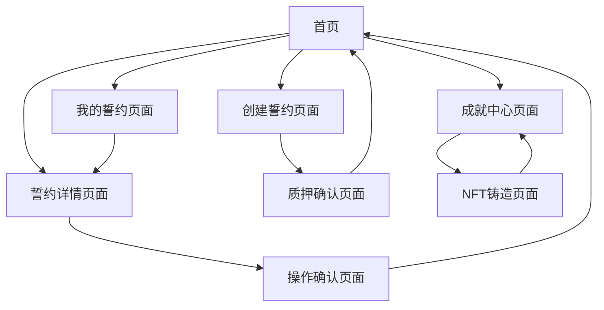

# ChainOath项目重构产品需求文档

## 1. 产品概述

ChainOath是一个基于区块链的去中心化誓约管理平台，通过智能合约实现誓约创建、资金托管、完成验证和成就激励的完整闭环。本次重构旨在构建更加完善的角色系统、资金管理机制和社交功能，提供安全可靠的链上誓约服务。

该平台解决了传统承诺缺乏约束力的问题，通过经济激励和区块链不可篡改特性，为用户提供可信的誓约履行环境。目标是成为Web3生态中领先的去中心化承诺管理平台。

## 2. 核心功能

### 2.1 用户角色

| 角色 | 注册方式 | 核心权限 |
|------|----------|----------|
| Creater（誓约发布者） | 钱包连接注册 | 创建誓约、质押资金、评估完成状态、发起任务检验 |
| Committer（守约人） | 钱包连接注册 | 接受誓约、完成任务、获得奖励、提交完成证明 |
| 普通用户 | 钱包连接注册 | 浏览誓约、点赞评论、mint成就NFT |

### 2.2 功能模块

本项目包含以下核心页面：

1. **首页**：誓约展示列表、筛选排序、热门推荐
2. **创建誓约页面**：誓约信息填写、代币选择、资金质押
3. **誓约详情页面**：详细信息展示、进度跟踪、社交互动
4. **我的誓约页面**：个人誓约管理、状态监控、收益统计
5. **成就中心页面**：NFT成就展示、mint操作、成就进度
6. **管理面板页面**：合约管理、数据统计、系统配置

### 2.3 页面详情

| 页面名称 | 模块名称 | 功能描述 |
|----------|----------|----------|
| 首页 | 誓约列表 | 展示所有公开誓约，支持按状态、时间、金额筛选排序 |
| 首页 | 搜索筛选 | 提供关键词搜索、标签筛选、高级筛选功能 |
| 首页 | 统计面板 | 显示平台总体数据：总誓约数、成功率、资金池等 |
| 创建誓约页面 | 基础信息 | 填写标题、描述、截止时间等基本信息 |
| 创建誓约页面 | 角色设置 | 选择或输入committer地址，验证角色合法性 |
| 创建誓约页面 | 资金配置 | 选择ERC-20代币、设置bounty金额、执行质押操作 |
| 创建誓约页面 | 检查点设置 | 配置任务检查点、完成标准、验收条件 |
| 誓约详情页面 | 信息展示 | 显示誓约完整信息、当前状态、进度条 |
| 誓约详情页面 | 社交互动 | 点赞功能、评论系统、分享操作 |
| 誓约详情页面 | 操作面板 | 根据用户角色显示相应操作按钮（评估、提交等） |
| 我的誓约页面 | 誓约管理 | 分类显示创建的和参与的誓约，状态筛选 |
| 我的誓约页面 | 收益统计 | 显示获得的奖励、质押资金、历史收益 |
| 我的誓约页面 | 快速操作 | 提供批量操作、快速评估、一键提取功能 |
| 成就中心页面 | 成就展示 | 展示所有可获得的成就NFT及获取条件 |
| 成就中心页面 | NFT管理 | 显示已拥有的NFT、mint新成就、转移操作 |
| 成就中心页面 | 进度跟踪 | 显示各项成就的完成进度和解锁状态 |
| 管理面板页面 | 合约监控 | 显示合约状态、交易统计、异常告警 |
| 管理面板页面 | 数据分析 | 提供用户行为分析、资金流向、成功率统计 |

## 3. 核心流程

### Creater流程
1. 连接钱包并验证身份
2. 填写誓约基础信息（标题、描述、截止时间）
3. 设置committer地址并验证角色合法性
4. 选择ERC-20代币并设置bounty金额
5. 执行资金质押操作，资金进入冻结状态
6. 誓约发布成功，进入生命周期管理
7. 可随时发起任务检验和完成评估
8. 根据评估结果解冻资金或转移给committer

### Committer流程
1. 浏览可参与的誓约列表
2. 查看誓约详情和要求
3. 接受誓约并开始执行任务
4. 按照检查点要求提交完成证明
5. 等待creater评估或自动解锁
6. 获得奖励资金和相应成就

### 页面导航流程图

## 4. 用户界面设计

### 4.1 设计风格

- **主色调**：深蓝色(#1E3A8A)作为主色，浅蓝色(#3B82F6)作为辅助色
- **按钮样式**：圆角矩形按钮，支持悬停和点击状态变化
- **字体规范**：Inter字体，标题18-24px，正文14-16px，说明文字12px
- **布局风格**：卡片式布局，顶部导航栏，响应式网格系统
- **图标风格**：使用Heroicons图标库，简洁现代的线性图标

### 4.2 页面设计概览

| 页面名称 | 模块名称 | UI元素 |
|----------|----------|--------|
| 首页 | 誓约列表 | 卡片式布局，每个誓约显示标题、金额、状态、进度条 |
| 首页 | 筛选栏 | 下拉选择器、搜索框、标签按钮，固定在列表顶部 |
| 创建誓约页面 | 表单区域 | 分步骤表单，进度指示器，输入验证提示 |
| 创建誓约页面 | 预览区域 | 实时预览誓约卡片，显示填写的信息 |
| 誓约详情页面 | 信息面板 | 左侧详细信息，右侧操作按钮和状态指示 |
| 誓约详情页面 | 评论区域 | 评论列表，点赞按钮，回复功能 |
| 我的誓约页面 | 标签页 | 创建的/参与的誓约分类显示，状态筛选 |
| 成就中心页面 | NFT网格 | 3列网格布局，每个NFT显示图片、名称、描述 |

### 4.3 响应式设计

项目采用移动端优先的响应式设计，支持桌面端、平板端和移动端访问。在移动端优化触摸交互体验，确保按钮大小适合手指操作，表单输入友好。